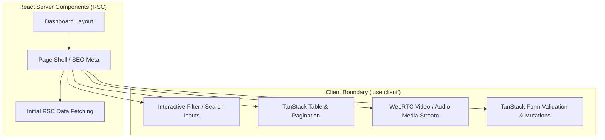
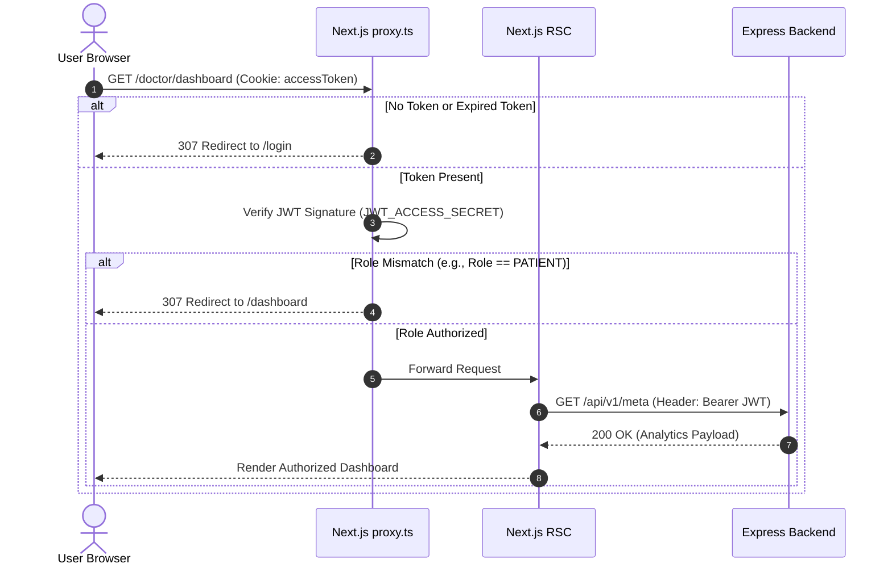
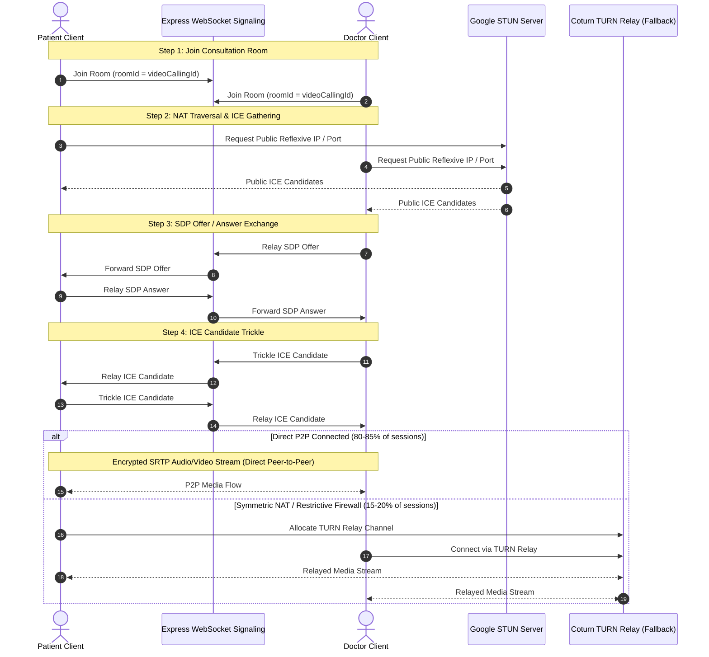

# Medix — Frontend Architecture & Telemedicine Technical Design

- **Status**: Production Reference
- **Framework**: Next.js 16 (App Router), React 19, TypeScript 5.9+
- **Styling**: Tailwind CSS v4, Radix UI Primitives, Lucide Icons
- **State & Data**: TanStack Query v5, TanStack Form, TanStack Table
- **Related Documents**: [srs.md](srs.md), [backend_design.md](backend_design.md), [testing_and_documentation_spec.md](specs/testing_and_documentation_spec.md)

---

## 1. Architectural Principles & Layout Topology

The Medix web client is engineered using the **Next.js 16 App Router**, emphasizing declarative routing, streaming server-side rendering, and minimal client-side JavaScript bundle sizes.

### 1.1 Route Groups & Layout Hierarchy

Route groups `(groupName)` isolate layout shells and access policies without introducing URL path segments:

```text
frontend/src/app/
├── (commonLayout)/                     # Public & Marketing Layout Shell
│   ├── page.tsx                        # Homepage / Landing page
│   ├── doctors/                        # Public doctor directory & search
│   ├── login/                          # Authentication entry
│   ├── register/                       # Patient self-registration
│   └── layout.tsx                      # Public header, navigation, and footer
│
├── (dashboardLayout)/                  # Authenticated Dashboard Shell
│   ├── admin/                          # System Administration Portal
│   │   ├── dashboard/                  # Platform metrics and revenue graphs
│   │   ├── users/                      # User management (doctors, admins, patients)
│   │   └── specialties/                # Medical specialty management
│   ├── doctor/                         # Clinician Workspace
│   │   ├── dashboard/                  # Daily schedule, pending consultations
│   │   ├── schedules/                  # Calendar time slot manager
│   │   └── appointments/               # Patient queue & video calling launcher
│   ├── dashboard/                      # Patient Portal
│   │   ├── appointments/               # Booked appointments & joining interface
│   │   ├── prescriptions/              # Digital prescription history
│   │   └── payment/                    # Stripe checkout redirection & receipts
│   └── layout.tsx                      # Collapsible sidebar, notification center, user menu
│
├── api/                                # Next.js Edge & Node API route handlers
├── layout.tsx                          # Root layout (Fonts, ThemeProvider, QueryClientProvider)
└── not-found.tsx                       # Global 404 handler
```

---

## 2. Server Components (RSC) vs Client Components

Medix enforces strict separation between server-rendered presentation and client-side interactivity to maximize Largest Contentful Paint (LCP) and minimize Interaction to Next Paint (INP):



### Guidelines
1. **Default to Server Components**: Every page and layout file is an RSC by default. Data fetching that does not require user credentials in the browser is initiated server-side.
2. **Push `'use client'` to the Leaves**: Only annotate components with `'use client'` if they utilize:
   - React state or lifecycle hooks (`useState`, `useEffect`, `useCallback`).
   - Browser DOM APIs (`window`, `navigator.mediaDevices`, `RTCPeerConnection`).
   - Interactive event listeners (`onClick`, `onChange`, `onSubmit`).
3. **Pass Server Data as Props**: RSCs fetch data and pass typed models down to interactive client components, eliminating waterfall fetches on mount.

---

## 3. Server State & Cache Invalidation (TanStack Query v5)

All asynchronous server communication is coordinated through **TanStack Query v5**, providing deterministic caching, background refetching, and optimistic updates.

### 3.1 Query Key Factory Pattern
All cache keys are structured hierarchically to enable precise cache invalidation:

```typescript
export const appointmentKeys = {
  all: ['appointments'] as const,
  lists: () => [...appointmentKeys.all, 'list'] as const,
  list: (filters: Record<string, unknown>) => [...appointmentKeys.lists(), filters] as const,
  details: () => [...appointmentKeys.all, 'detail'] as const,
  detail: (id: string) => [...appointmentKeys.details(), id] as const,
  myAppointments: () => [...appointmentKeys.all, 'my'] as const,
};
```

### 3.2 Mutation Invalidation Protocol
When state changes occur (e.g., booking an appointment or canceling status):
1. The mutation is executed via the typed service client.
2. On success, `queryClient.invalidateQueries({ queryKey: appointmentKeys.all })` triggers automatic background reconciliation.
3. User notifications are dispatched via `sonner` toasts.

---

## 4. Authentication & Role-Based Access Control (RBAC)

Authentication state is synchronized between BetterAuth cookies, custom JWT bearer tokens, and Next.js middleware.



### 4.1 Request Guard (`src/proxy.ts`)
- The Next.js edge/node request proxy inspects HTTP-only cookies on every navigation.
- Decodes the user role (`SUPER_ADMIN`, `ADMIN`, `DOCTOR`, `PATIENT`).
- Prevents cross-role navigation (e.g., Patients attempting to access `/admin/*`).
- Handles forced password changes and unverified emails by redirecting to `/reset-password` or `/verify-email`.

---

## 5. WebRTC Peer-to-Peer Telemedicine Architecture

The telemedicine subsystem enables direct, encrypted audio/video communication between a Doctor and Patient using browser-native `RTCPeerConnection` without routing video streams through intermediate application servers.



### 5.1 Signaling Protocol
- **Channel**: Lightweight WebSocket channel on Express (`ws://localhost:5000/signaling`).
- **Room Identification**: Keyed by unique `videoCallingId` (UUIDv7) generated upon appointment creation.
- **Payloads**:
  - `ready`: Participant notifies room readiness.
  - `offer`: Serialized SDP offer describing audio/video codecs.
  - `answer`: Serialized SDP answer accepted by peer.
  - `ice-candidate`: Network routing candidates.

### 5.2 NAT Traversal (STUN & TURN)
- **STUN (Free Google Public STUN)**:
  - Primary ICE server: `stun:stun.l.google.com:19302`.
  - Handles NAT discovery for residential broadband and non-symmetric routers (~85% success).
- **TURN (Self-Hosted Coturn Relay)**:
  - Deployed on a minimal cloud VPS running `coturn`.
  - Activated when direct P2P fails due to symmetric mobile carrier NATs or hospital firewalls.
  - Credentials generated with time-limited HMAC authentication.

### 5.3 Media Lifecycle & Device Management
- **Permissions**: `navigator.mediaDevices.getUserMedia({ video: true, audio: true })`.
- **Mute & Privacy**: Audio and video tracks toggled directly on the local `MediaStream` (`track.enabled = false`) without renegotiating peer connections.
- **Teardown**: On call termination, all `MediaStreamTrack`s are stopped (`track.stop()`), peer connection closed (`pc.close()`), and appointment transitioned to `COMPLETED`.

---

## 6. Form Architecture & UI Design System

- **Validation Engine**: Forms utilize **TanStack Form** paired with **Zod 4** schemas, ensuring compile-time safety and runtime validation.
- **Design Tokens**: Standardized on **Tailwind CSS v4** utility classes with CSS variables for light/dark theme switching (`next-themes`).
- **Accessibility**: Primitive interactive components built on **Radix UI** primitives guaranteeing ARIA compliance, keyboard focus trapping, and screen-reader announcements.
